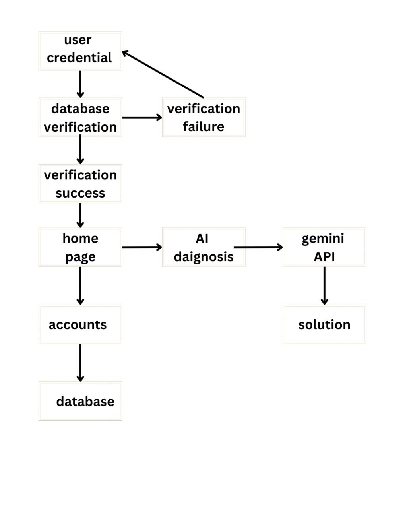
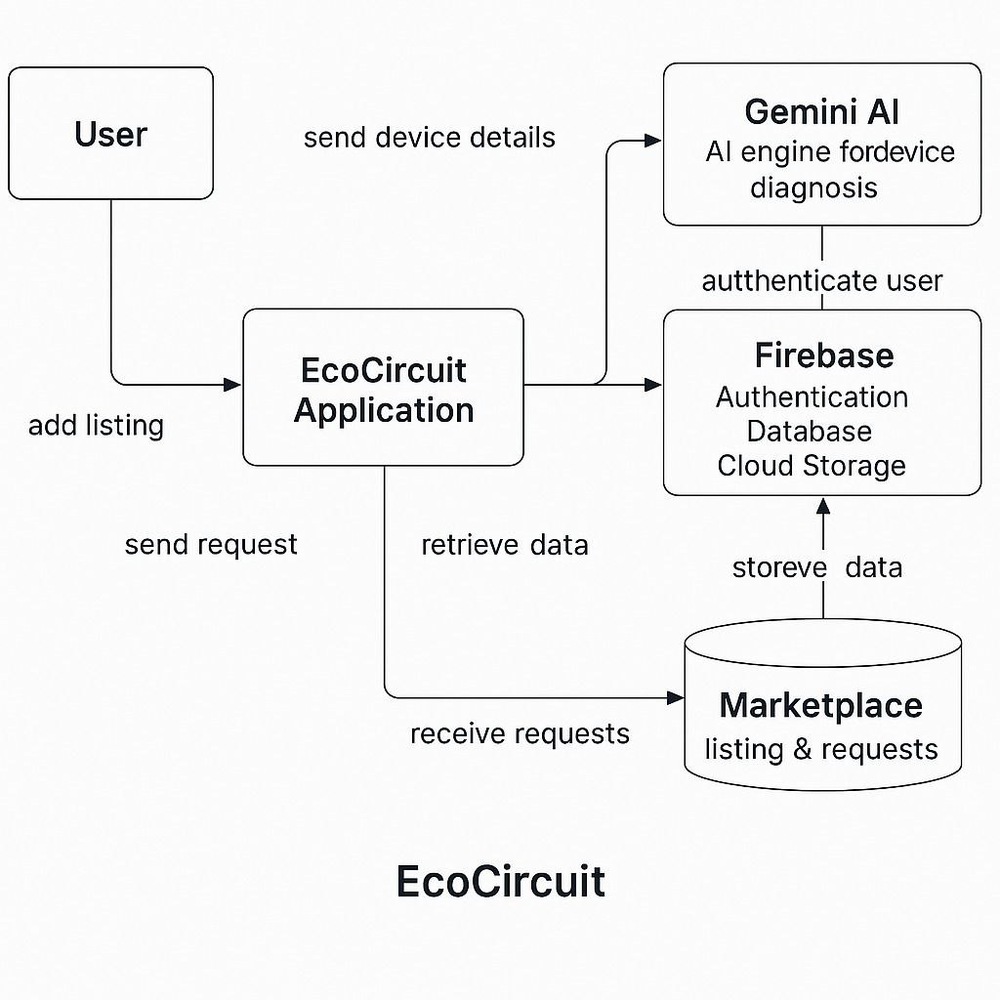

# 🌿 EcoCircuit

**EcoCircuit** is an AI-powered mobile application built to reduce e-waste by diagnosing electronic devices, suggesting repair solutions, and offering resell/recycle options—all through a unified platform.

---

## 🚀 Features

- 🔍 Scan or upload devices to get an instant AI diagnosis
- 🛠 DIY repair instructions using Gemini AI
- 💰 Resell damaged/half-used electronics via in-app marketplace
- ♻️ Find nearby recycling centers and repair stations
- 📊 Track environmental impact (carbon saved, badges earned)
- 👤 User profile with editable info and device history
- 📦 Buyer-seller interaction and purchase request handling

---

## 🧠 Architecture Diagram



---

## 🔁 User Flow Diagram




---

## 🧪 Installation & Setup

1. **Clone the repository**
   ```bash
   git clone https://github.com/your-username/ecocircuit.git
   cd ecocircuit
   ```

2. **Install dependencies**
   ```bash
   flutter pub get
   ```

3. **Connect to Firebase**
   - Add your `google-services.json` (Android) and `GoogleService-Info.plist` (iOS) to the respective directories.
   - Ensure Firebase project is set up with Authentication, Firestore, and Storage.

4. **Run the app**
   ```bash
   flutter run
   ```

---

## 🛠 Tech Stack

- **Flutter** – Frontend (cross-platform)
- **Firebase** – Auth, Firestore, Storage
- **Gemini AI API** – Diagnosis engine
- **Google Maps API** – Location services

---

## 📈 Future Enhancements

- ✅ Secure payment and delivery system
- ✅ Warranty & invoice upload
- ✅ Leaderboard and gamified eco badges
- ✅ Chat support with certified technicians

---

## 🤝 Contribution

We welcome contributions! Please open issues, fork the repo, and submit pull requests.

---

## 📄 License

This project is licensed under the [MIT License](LICENSE).

---

> Made with ❤️ for a greener planet 🌍 by Team NOVA
